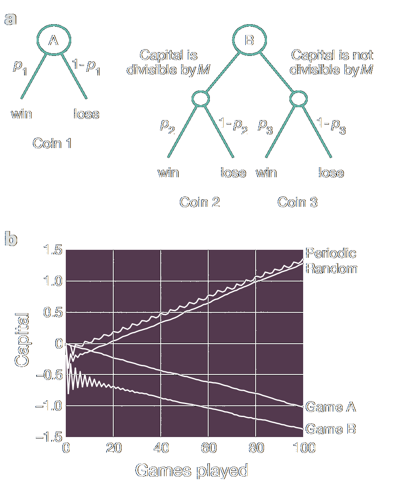
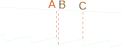

# Persistence through switching environments

Riz Fernando Noronha

---

> *Can you have two environments, where in both cases the inferior species dies, but it can survive by switching between them?*

---

<iframe width="100%" height="100%" src="https://rizfn.github.io/survival-by-switching/visualizations/kuniSchematic"">
</iframe>

---

## Standard Models

Population dynamics: Verlhust

$$\frac{\mathrm{d}x}{\mathrm{d}t} = r\, x\left(1-\frac{x}K\right)$$

Interactions: Lotka-Volterra

$$
\begin{align}
    \frac{\mathrm{d}x}{\mathrm{d}t} &= r\,x - \beta\,x y \\ 
    \frac{\mathrm{d}y}{\mathrm{d}t} &= \delta\, x y  - \gamma\, y
\end{align}
$$

---

## Equations

$$
\begin{align}
    \frac{\mathrm{d}x}{\mathrm{d}t} &= r_E\,x\left(1-\frac{x}{K_E}\right) - x y \\ 
    \frac{\mathrm{d}y}{\mathrm{d}t} &= x y  - \gamma_E\, y
\end{align}
$$

$K_E:$ Carrying capacity
$r_E:$ Growth rate of prey
$\gamma_E:$ Death rate of predator

---

**Environment 1** 
$K_E=1,\; r_E=1, \; \gamma_E=1$

**Environment 2** 
$K_E=2,\; r_E=4, \; \gamma_E=2.2$

$$\begin{align}
    \frac{\mathrm{d}x}{\mathrm{d}t} &= x\left(1-x\right) - x y \\
    \frac{\mathrm{d}y}{\mathrm{d}t} &= x y  - y
\end{align}$$

$$\begin{align}
    \frac{\mathrm{d}x}{\mathrm{d}t} &= 4x\left(1-\frac{x}{2}\right) - x y  \\
    \frac{\mathrm{d}y}{\mathrm{d}t} &= x y - 2.2y
\end{align}$$

---

<iframe width="100%" height="100%" src="https://rizfn.github.io/survival-by-switching/visualizations/3paramLogisticLV" style="border: 1px solid #888888">
</iframe>

---

<iframe width="100%" height="100%" src="https://rizfn.github.io/survival-by-switching/visualizations/3paramLogisticLV/trajectories" style="border: 1px solid #888888">
</iframe>

---

<iframe style="position:relative; bottom:70px;" width="100%" height="130%" src="https://rizfn.github.io/survival-by-switching/visualizations/3paramLogisticLV">
</iframe>

### Switching rate?

Slow switching: $T\to \infty$

Fixed environment!

$\\$

Fast switching: $T\to0$

Averaged environment!

---

### Fixed environment

$$\begin{align}
    0 = \frac{\mathrm{d}x}{\mathrm{d}t} &= rx\left(1-\frac{x}{K}\right) - x y \\
    0 = \frac{\mathrm{d}y}{\mathrm{d}t} &= x y  - \gamma y
\end{align}$$

Second equation gives

$y=0, \quad x=\gamma$

---

Using $x=\gamma$ in the first nullcline:

$\\$

$$ rx\left(1-\frac{x}{K}\right) - x y = 0 $$

$$ y = r\left(1-\frac{\gamma}{K}\right)  $$

$\\$

The fixed point is **inaccessible** if $y<0$

$\implies \gamma \geq K$ for death in fixed env!

---

### Fast switching

Dynamics are the average of the vector fields:

$$
\begin{align}
    \frac{\mathrm{d}x}{\mathrm{d}t} &= \frac12\left[r_1x\left(1-\frac{x}{K_1}\right) - x y \right] + \frac12\left[r_2x\left(1-\frac{x}{K_2}\right) - x y \right]\\
    \frac{\mathrm{d}y}{\mathrm{d}t} &=\frac12 \left[xy - \gamma_1 y\right] + \frac12 \left[xy - \gamma_2 y\right]
\end{align}
$$

Again, calculate fixed points!

---

In the second nullcline,

$$
\begin{align*}
\frac{\mathrm{d}y}{\mathrm{d}t} &=\frac12 \left[xy - \gamma_1 y + xy - \gamma_2 y\right] \\
0 &= xy - \frac{\gamma_1 + \gamma_2}{2} y \\
0  &= y\,\left(x -\frac{\gamma_1 + \gamma_2}{2} \right)
\end{align*}
$$

$$y=0,\quad x = \frac{\gamma_1 + \gamma_2}{2} = \bar{\gamma} $$

---

Using the second condition in the first nullcine,

$$
\begin{align*}
\frac{\mathrm{d}x}{\mathrm{d}t} &= \frac{x}2\left[r_1\left(1-\frac{x}{K_1}\right) - y + r_2\left(1-\frac{x}{K_2}\right) - y \right]\\
y^* &= \frac{1}{2} \left[ r_1 \left(1 - \frac{\bar{\gamma}}{K_1}\right) + r_2 \left(1 - \frac{\bar{\gamma}}{K_2}\right) \right]
\end{align*}
$$

To survive, $y^* > 0$, which implies

$$
(r_1 + r_2) - \left(\frac{r_1 \bar{\gamma}}{K_1} + \frac{r_2 \bar{\gamma}}{K_2}\right) > 0
$$

---

**Necessary** and **Sufficient** conditions:

$\\$

1. $$\gamma_1 \geq K_1,\quad \gamma_2 \geq K _2$$
$\\$

2. $$ \frac{\gamma_A + \gamma_B}{2} < \frac{r_A + r_B}{\frac{r_A}{K_A} + \frac{r_B}{K_B}} $$

---

### Parametric resonance

Matheiu Equation

$$ \frac{\mathrm{d^2}x}{\mathrm{d}t^2} + \left(\delta + \epsilon\cos(\omega t)\right) x = 0$$

$\\$

Fixed $\delta$ $\implies$ decay
Switching $\delta$ $\implies$ resonance

---

### Parrondo's Paradox

Two losing games, of tossing three biased coins:

$\\$

- Game A: Toss a coin, win with probability $p_1=\frac12-\epsilon$

- Game B: If $W$ is divisible by 3, win with $p_2=\frac1{10}-\epsilon$. 
$\\\qquad\quad\;\;\,$ If not divisible by 3, win with $p_3=\frac34-\epsilon$

---

For $\epsilon=0.005$:

$p_2$ chosen $\approx 40\%$ of the time, so game B also loses.

Swapping A-A-B-B-... : **Wins!**
Swapping A-B-A-B-... : **Loses**
Swapping A-B-B-... : **Wins**

Random switching also **Wins!!**

---

#### Two ratchets!

- Start at B, top ratchet

- Switch when a ball reaches A, OR

- Switch before reaching C.

- After steady state, switch back!

---

Uses two states to win.

Game B loses for its own money distribution, but can win by using a distribution from game A.

Similarly, we use ICs generated by environment B to have environment A boost the population.

---

### Generalized Model

$$
\frac{dx}{dt} = F_{\sigma(t)}(x,y)
$$

$\\$

$$
\frac{dy}{dt} = G_{\sigma(t)}(x,y)
$$

---

## Conclusion

Switching environments can survive!

Try stochastic switching, continuous change, etc

In reality?

---

## Extra Slides

---

## Original Equations

$$
\begin{align}
    \frac{\mathrm{d}x}{\mathrm{d}t} &= x\left(1-\frac{x}{K_E}\right) - x y e^{-\alpha_E x} \\ 
    \frac{\mathrm{d}y}{\mathrm{d}t} &= x y  e^{-\alpha_E x} - y
\end{align}
$$

$K_E:$ Carrying capacity
$\alpha_E:$ Shielding factor

---

**Environment 1** 
$K_E=1,\quad \alpha_E = 0$

**Environment 2** 
$K_E=2,\quad \alpha_E=0.4$

$$\begin{align}
    \frac{\mathrm{d}x}{\mathrm{d}t} &= x\left(1-x\right) - x y \\
    \frac{\mathrm{d}y}{\mathrm{d}t} &= x y  - y
\end{align}$$

$$\begin{align}
    \frac{\mathrm{d}x}{\mathrm{d}t} &= x\left(1-\frac{x}{2}\right) - x y e^{-0.4x}  \\
    \frac{\mathrm{d}y}{\mathrm{d}t} &= x y e^{-0.4x} - y
\end{align}$$

---

### Environment 1

$$\begin{align}
    0 = \frac{\mathrm{d}x}{\mathrm{d}t} &= x\left(1-x\right) - x y \\
    0 = \frac{\mathrm{d}y}{\mathrm{d}t} &= x y  - y
\end{align}$$

$\\$

Fixed points are $(0,0)$ and $(1,0)$

---

### Environment 2

$$\begin{align}
    \frac{\mathrm{d}x}{\mathrm{d}t} &= x\left(1-\frac{x}{2}\right) - x y e^{-\alpha_2x} \\
    \frac{\mathrm{d}y}{\mathrm{d}t} &= x y e^{-\alpha x} - y
\end{align}$$

$\\$

Fixed points are $(0,0)$, $(2,0)$, and one more...

Checking stability gives lower bound on $\alpha$.